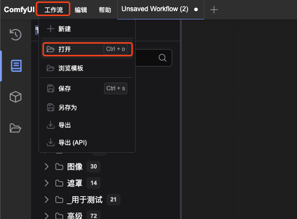
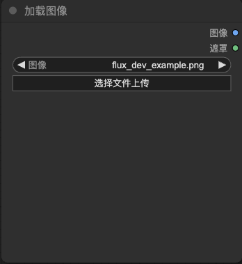

## 使用 ComfyUI 进行 Text2Video 以及 Image2Video

### 部署 ComfyUI

```bash
kubectl apply -f manifests.yaml
```

### 使用 ComfyUI

使用以下命令获取 ComfyUI 的访问地址。

```bash
kubectl get svc comfyui -o jsonpath='{.status.loadBalancer.ingress[0].ip}:{.spec.ports[0].port}'
```

#### Text2Video

1. 浏览器中打开 ComfyUI 的访问地址。
2. 打开工作流，选中本地的 `workflows/text_to_video_wan.json` 文件。  

3. 点击运行并预览。

#### Image2Video

1. 浏览器中打开 ComfyUI 的访问地址。
2. 打开工作流，选中本地的 `workflows/image_to_video_wan.json` 文件。  

3. 选择输入图片，可以使用 `images/flux_dev_example.png` 作为示例图片。  

4. 点击运行并预览。
