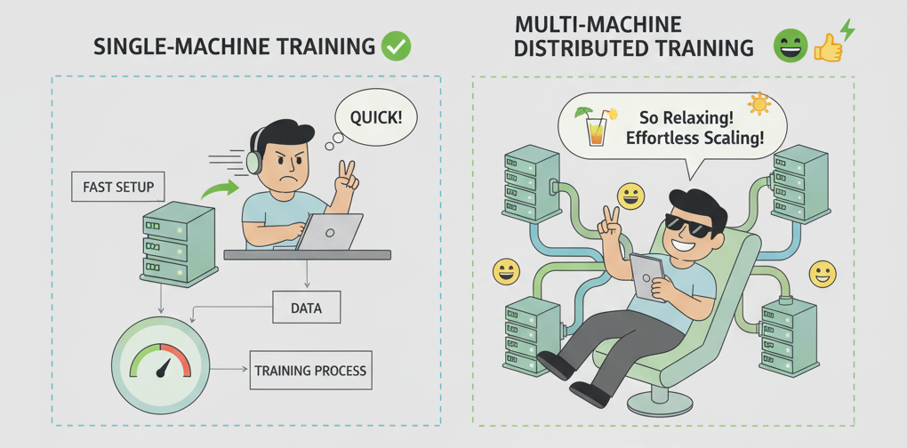
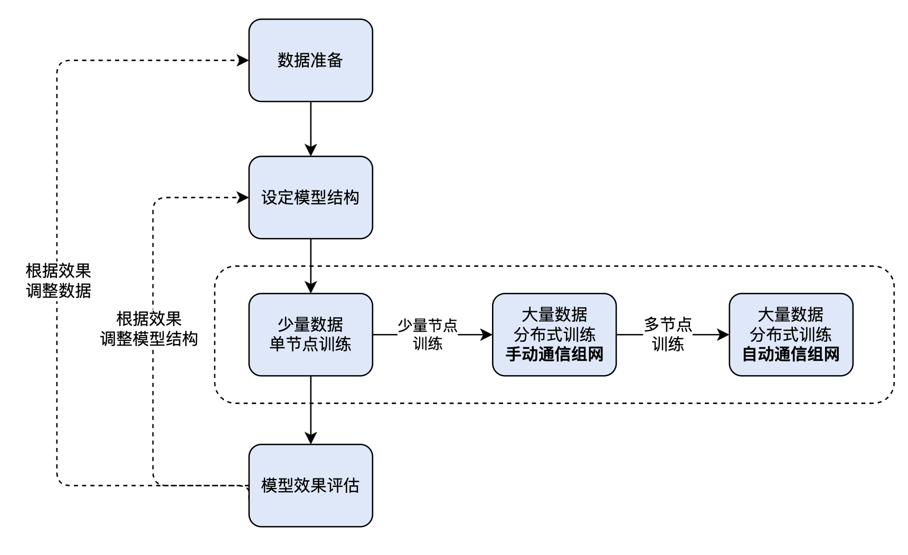
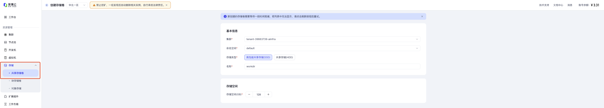
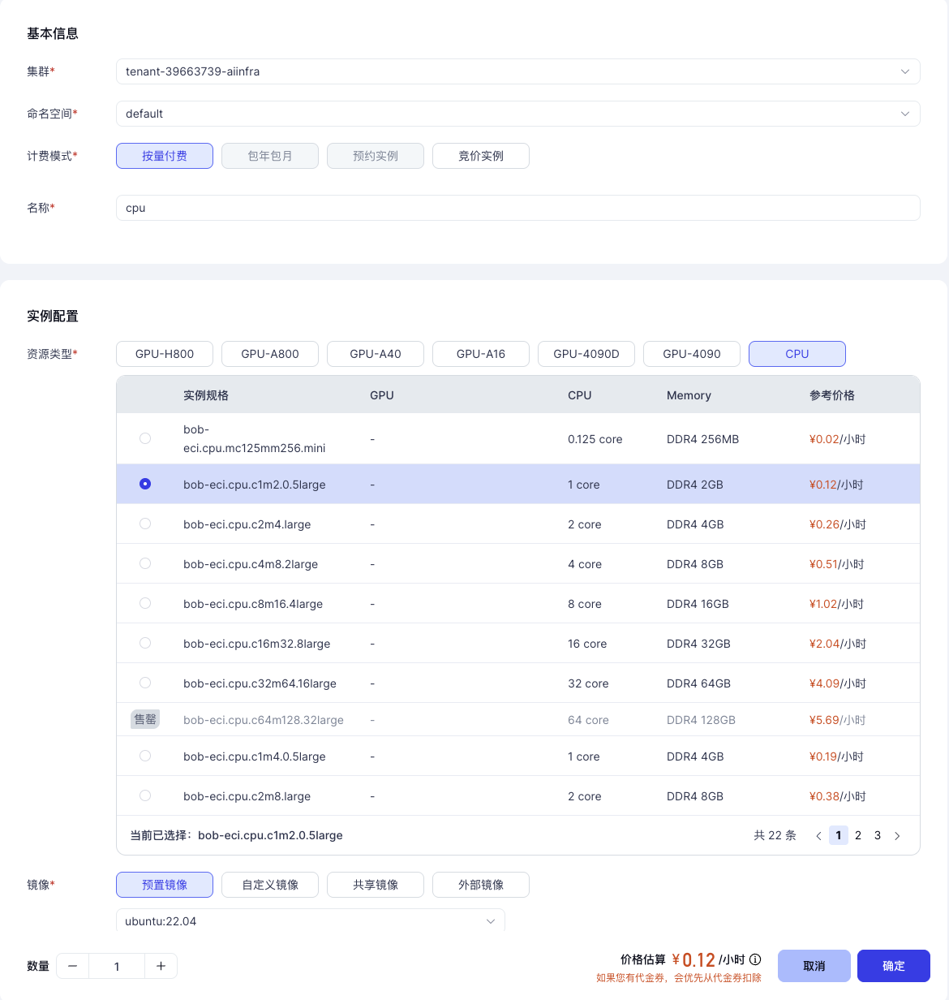
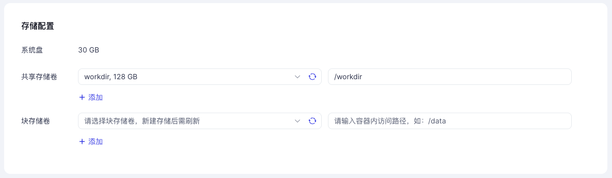
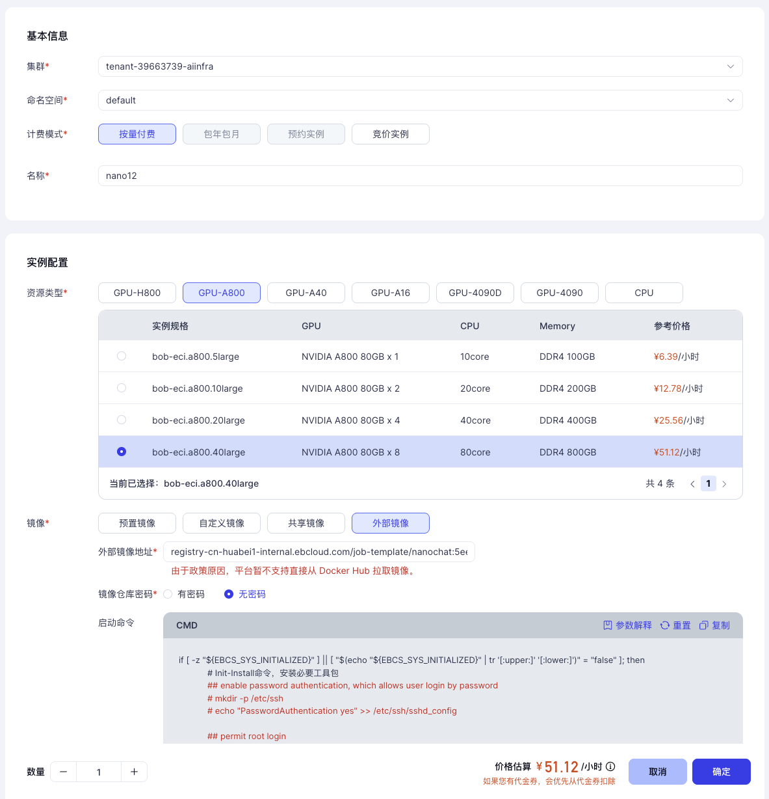
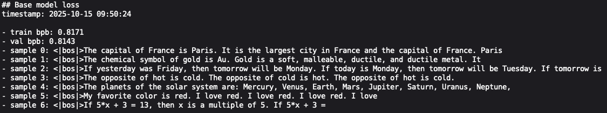
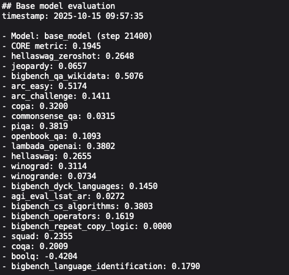
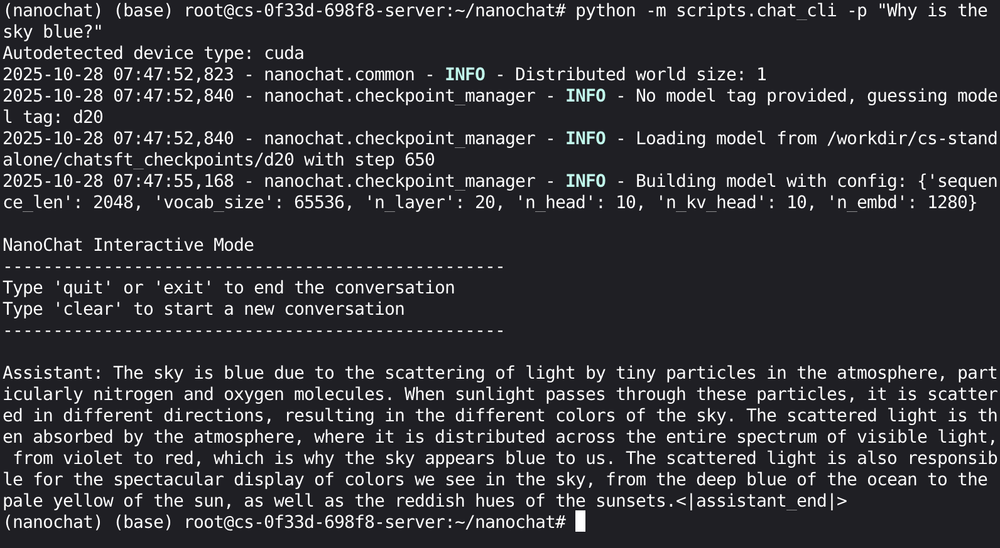

# 快速实验，轻松扩展！手把手教你用英博云进行模型开发全流程

还在为大模型开发流程复杂、算力调度难发愁？以 nanochat 模型为例，使用英博云平台丰富的弹性算力，您可以快速进行模型实验，通过简单配置即可扩展训练规模，轻松达成训练效率成倍飙升，并且保持训练成本。不管你是想快速验证模型架构，还是进行大规模分布式训练，这篇实操指南都能帮你少走弯路，高效搞定模型开发全流程。



## 引言

在 [别花100美元了！30美元，我们跑通了Karpathy的ChatGPT](https://mp.weixin.qq.com/s/VYVLMQM_BrxtZf0Xmq8nOw) 文章中，我们已经介绍了 nanochat 模型在单机环境下的训练流程与成本分析。

本文将进一步以 nanochat 模型的开发流程为例，演示如何在英博云平台上，借助弹性算力与共享存储机制，高效完成从原型实验到大规模分布式训练的全过程：
  1. 数据准备与模型结构设计：从训练数据准备入手，设定 nanochat 模型结构；  
  2. 从单机到多机分布式训练实践：模型训练往往是模型开发全流程中最耗时、最消耗算力资源的阶段。为了兼顾效率与成本，我们将按以下流程进行：  
    1. 在单台开发机上进行单节点训练，便于快速开展模型实验与调试，无需处理跨节点通信；  
    2. 再采用两台开发机进行多节点训练，手动配置通信拓扑，灵活控制训练环境和策略；  
    3. 进一步使用基于 kubeflow 的分布式训练任务提交方式，自动配置通信拓扑，快速将训练规模拓展到百卡甚至千卡，提高训练效率并保持训练成本。  
  3. 模型效果评估：在同一平台上直接进行验证与推理，实现训推一体的高效开发闭环。



## 数据准备

### 创建共享存储卷

为了给模型的训练准备数据，并保存模型训练过程产生的数据，我们需要在英博云控制台上创建一个 128 GB 大小的共享存储卷，并在后续步骤中都配置使用该共享存储卷。


### 创建开发机

英博云开发机即弹性容器实例（Ebtech Container Instance，简称 ECI），支持您挂载 1/2/4/8 个 GPU 或纯 CPU，用于在线调试和模型开发。拥有相比虚拟机实例性能损失少，效率高等优点。  
我们可以在英博云上申请一台 CPU 开发机，通过 CPU 开发机我们可以预先进行训练数据的准备工作，并且方便获取和使用英博云提供的各种内置资源，在挂载已创建的共享存储后，还可以方便地查看训练日志、模型 checkpoints 等数据。
  1. 在开发机创建页面，选择 CPU 开发机
  2. 选择镜像时，选定“预置镜像”，按需选择 ubuntu 版本，这里我们选择 22.04 版本
  
  3. 挂载已创建的共享存储
  

### 准备训练数据

CPU 开发机启动完毕后，点击开发机实例的右侧按钮 "JupyterLab" 即可打开 Jupyter 页面。我们可以在 JupyterLab 的 Terminal 中执行以下命令快速完成数据准备。我们将创建多个目录分别对不同训练方式使用和产生的数据进行存放。

``` bash
# 单机训练任务数据
mkdir -p /workdir/cs-standalone
cp -r /public/shared-resources/cache/nanochat-cache/nanochat/. /workdir/cs-standalone

# 两机训练任务数据
mkdir -p /workdir/cs-dist
cp -r /public/shared-resources/cache/nanochat-cache/nanochat/. /workdir/cs-dist

# 多机训练任务数据
mkdir -p /workdir/kf-dist
cp -r /public/shared-resources/cache/nanochat-cache/nanochat/. /workdir/kf-dist
```

此外，英博云提供的共享 Huggingface 数据集中也存放了 nanochat 的完整数据集，您可以在开发机的 `/public/huggingface-datasets/karpathy/fineweb-edu-100b-shuffle` 路径下获得，并按需进行训练数据量的调整。

### 配置 kubectl 连接集群

我们参考英博云的帮助文档 https://docs.ebtech.com/docs/cluster/attach.html 来配置 kubectl 并连接集群，为后续的实践步骤做好准备。

## 设定模型结构

在进行 nanochat 的预训练之前，参考 nanochat 的预训练脚本 [base_train.py](https://github.com/karpathy/nanochat/blob/c75fe54aa7c1fa881701c246f9427bcbe4eee5a4/scripts/base_train.py)，我们可以设定 nanochat 模型的层数、维度、注意力 Heads 数、Key/Value Heads 数等结构参数。后续的示例中我们将设定如下模型结构进行预训练，并快速对模型进行评估和推理验证。

``` text
num_layers: 20
model_dim: 1280
num_heads: 10
num_kv_heads: 10
Number of parameters: 560,988,160
```

## 模型训练

### 单机训练

首先，前往英博云的控制台，创建一台 8 卡 A800 开发机。
  1. 在开发机创建页面，选择 8 卡 A800 服务器。  
  2. 选择镜像时，选定“外部镜像”，并填写镜像地址：`registry-cn-huabei1-internal.ebcloud.com/job-template/nanochat:c75fe54`  
  3. 镜像仓库密码处，选择“无密码”即可。  

  4. 挂载已创建的共享存储  

开发机启动完毕后，我们在开发机 JupyterLab 的 Terminal 中执行以下命令运行任务，您也可以在 Terminal 中启动一个 Tmux Session 并执行以下命令。

``` bash
cd /root/nanochat
source .venv/bin/activate
source "$HOME/.cargo/env"
export NANOCHAT_BASE_DIR=/workdir/cs-standalone

torchrun --standalone \
    --nproc_per_node=8 \
    -m scripts.base_train \
    -- --depth=20 \
    --device_batch_size=32 \
    --total_batch_size=1048576
```

  随后我们可以在 JupyterLab Terminal 中观察到对应的训练日志。

``` text
step 00029/10700 (0.27%) | loss: 6.296391 | lrm: 1.00 | dt: 2225.85ms | tok/sec: 235,544 | mfu: 20.79 | total time: 0.71m
step 00030/10700 (0.28%) | loss: 6.265557 | lrm: 1.00 | dt: 2223.26ms | tok/sec: 235,819 | mfu: 20.81 | total time: 0.74m
step 00031/10700 (0.29%) | loss: 6.241041 | lrm: 1.00 | dt: 2220.22ms | tok/sec: 236,142 | mfu: 20.84 | total time: 0.78m
```

需要注意的是当前版本 nanochat 的 MFU 统计是按 H100 算力为基准计算的，在 A800 上运行时显示的 MFU 会比实际 MFU 要低。  
在选定的训练数据规模上，预训练阶段需要在 8 卡 A800 上运行约 6.6 小时。在实际训练过程中，我们可能会感觉训练时间太长，并希望在近似的成本下用更短的时间完成模型训练，这时就需要用到多机的分布式训练了。

### 手动通信组网多机训练

我们按照单机训练任务中的操作，再次创建一台 8 卡 A800 开发机，并挂载我们之前创建的共享存储。  
我们选择将新创建的 8 卡 A800 开发机 `nano22` 与上一步中使用的 8 卡 A800 开发机 `nano12` 一起使用来进行多机训练。相较于单机训练，多机训练时训练节点之间需要使用 rank 为 0 的 master 节点的固定端口作为桥梁进行通信，还需要给每个训练节点分配 rank 等信息。  
分别点击两台开发机实例的右侧按钮 "JupyterLab" 打开 Jupyter 页面：

1. 我们选用 `nano12` 作为本次训练的 master 节点，在开发机的 JupyterLab 的 Terminal 中进行如下配置  
    1. 确定 master 节点的集群地址  
       1. 执行 `hostname -i` 命令，从命令输出可以得到 `nano12` 的集群内地址为 `10.233.75.95`  
    2. 配置 `torchrun` 分布式训练参数  
        1. `--nnodes`：总共 2 个训练节点，设置为 2
        2. `--node_rank`：master 节点的 node_rank 指定为 0
        3. `--master_addr`：指定为 `nano12` 节点的集群内地址 `10.233.75.95`
        4. `--master_port`：指定 `23456` 端口  
     3. 启动训练任务

        ``` bash
        cd /root/nanochat
        source .venv/bin/activate
        source "$HOME/.cargo/env"
        export NANOCHAT_BASE_DIR=/workdir/cs-dist

        torchrun --nnodes=2 \
            --node_rank=0 \
            --master_addr=10.233.75.95 \
            --master_port=23456 \
            --nproc_per_node=8 \
            -m scripts.base_train \
            -- --depth=20 \
            --device_batch_size=32 \
            --total_batch_size=1048576
        ```

2. 在 `nano22` 开发机的 JupyterLab 的 Terminal 中进行如下配置  
   1. 配置 `torchrun` 分布式训练参数  
      1. `--nnodes`：总共 2 个训练节点，设置为 2
      2. `--node_rank`：分配当前节点的 node_rank 为 1，节点间的 node_rank 不能相同
      3. `--master_addr`：指定为 `nano12` 节点的集群内地址 `10.233.75.95`
      4. `--master_port`：指定为 `23456` 端口  
   2. 启动训练任务

      ``` bash
      cd /root/nanochat
      source .venv/bin/activate
      source "$HOME/.cargo/env"
      export NANOCHAT_BASE_DIR=/workdir/cs-dist

      torchrun --nnodes=2 \
          --node_rank=1 \
          --master_addr=10.233.75.95 \
          --master_port=23456 \
          --nproc_per_node=8 \
          -m scripts.base_train \
          -- --depth=20 \
          --device_batch_size=32 \
          --total_batch_size=1048576
      ```

随后我们可以在 master 节点 `nano12` 的 JupyterLab Terminal 中观察到对应的训练日志。

``` text
step 00029/10700 (0.27%) | loss: 6.269156 | lrm: 1.00 | dt: 1137.04ms | tok/sec: 922,199 | mfu: 20.35 | total time: 0.43m
step 00030/10700 (0.28%) | loss: 6.239355 | lrm: 1.00 | dt: 1143.00ms | tok/sec: 917,392 | mfu: 20.24 | total time: 0.45m
step 00031/10700 (0.29%) | loss: 6.214127 | lrm: 1.00 | dt: 1139.73ms | tok/sec: 920,019 | mfu: 20.30 | total time: 0.46m
```

可以看到我们将单机 8 卡的训练扩展到双机 16 卡之后，每个 step 的耗时从 2.2s 左右降低到了 1.1s，符合线性的提升。整个训练的耗时也会从 8 卡 6.6 小时变成 16 卡的 3.3 小时，总成本不变，速度提升一倍。  
当然，我们可以进一步扩充训练资源，使用 4 台共 32 卡，或者 8 台共 64 卡进行模型训练，对应的耗时也会缩减到 1.7 小时（32 卡 A800），甚至 0.8 小时（64 卡 A800），同时保持训练成本基本不变。  
但是随着训练任务节点规模的提高，依然通过手动的方式逐个对训练任务进行拉起显然是低效且容易出错的。我们还提供了基于配置的训练任务提交方式，训练任务提交后会按照配置被自动拉起、并在指定的算力资源上运行，扩展训练任务的规模变得更加轻松和简单。

### 自动通信组网多机训练

我们点击已创建的 CPU 开发机实例的右侧按钮 "JupyterLab" 打开 Jupyter 页面。我们将在 JupyterLab 的 Terminal 中完成以下的所有步骤，实现提交和运行单机与多机的训练任务。

#### 安装基础组件

执行以下命令安装 kubeflow 的 training-operator 组件。training-operator 可以让用户快速进行基于 TensorFlow、PyTorch、MXNet、XGBoost 等框架的分布式训练。

``` bash
kubectl apply -f /public/shared-resources/k8s-resources/training-operator/v1.8.0/manifests.yaml
```

每个集群仅需安装一次即可，training-operator 本身需消耗很少量的 CPU 资源，使用完成后如需释放，可执行以下的命令进行清理。

``` bash
kubectl delete -f /public/shared-resources/k8s-resources/training-operator/v1.8.0/manifests.yaml
```

接下来，我们仍将会基于 `registry-cn-huabei1-internal.ebcloud.com/job-template/nanochat:c75fe54` 镜像来进行单机 8 卡 A800 与双机 16 卡 A800 训练任务的配置与提交。如果您在开发机中对训练环境做了调整，您可以参考英博云平台的开发机保存镜像功能 [https://docs.ebtech.com/docs/devmachine/saveimage.html](https://docs.ebtech.com/docs/devmachine/saveimage.html)，并使用保存后的镜像进行新的训练任务提交。

#### 提交训练任务

我们通过 YAML 配置文件来定义多机训练任务，配置文件中详细描述了以下几个部分：
1. 计算节点（Master 和 Worker 节点）的规格：
      1. 节点的 GPU/CPU/Memory 等资源规格
      2. 节点 `torchrun` 启动命令：
          ``` bash
          // ... 以上省略 ...
          torchrun --nnodes=$(PET_NNODES) \
              --node_rank=$(PET_NODE_RANK) \
              --master_addr=$(PET_MASTER_ADDR) \
              --master_port=$(PET_MASTER_PORT) \
              --nproc_per_node=$(PET_NPROC_PER_NODE) \
          // ... 以下省略 ...
          ```

          可以看到训练节点 `torchrun` 命令在进行分布式通信初始化时统一都使用了`PET_` 开头的环境变量。training-operator 会根据任务配置中定义的节点规模和 Master 节点信息，自动计算 `nnodes`、 `master_addr`、`master_port` 的值并以环境变量 `PET_NNODES`、`PET_MASTER_ADDR`、`PET_MASTER_PORT` 的形式注入到每个训练节点中，并且自动为所有节点各自分配不同的 `node_rank` 值并以环境变量 `PET_NODE_RANK` 的形式注入。
      3. Worker 节点的数量：通过调大 Worker 中 `replicas` 字段的值，可以声明增加训练节点的数量，training-operator 会严格按照配置创建出对应数目的训练节点，轻松实现扩展训练规模，无需其他额外配置
2. NCCL 相关配置：确保训练任务正确使用英博云的高速 RDMA 计算网络
3. 共享存储卷的挂载：确保训练日志与产物的持久化

我们可以执行以下命令来提交配置好的多机训练任务。

``` bash
kubectl apply -f /public/shared-resources/k8s-resources/training-operator/v1.8.0/examples/nanochat-dist.yaml
```

我们也可以使用以下命令来查看本次训练任务 master 节点的相关状态与日志。

``` bash
# 查看 master 节点的状态
kubectl get po nano-kf-master-0
# 查看 master 节点的详细状态
kubectl describe po nano-kf-master-0
# 查看 master 节点的日志
kubectl logs -f nano-kf-master-0
# 查找不同 rank 训练节点的日志文件
ls /workdir/kf-dist | grep log
```

#### 调整训练任务

我们可以将上述步骤使用到的训练配置 YAML 文件拷贝到 CPU 开发机的 `/workdir` 目录，然后修改文件做训练资源配置、训练参数、训练镜像等的调整，然后使用类似的 `kubectl apply -f {file_name}` 方式来提交训练任务。以 nanochat 为例，我们可以参考 [base_train.py](https://github.com/karpathy/nanochat/blob/c75fe54aa7c1fa881701c246f9427bcbe4eee5a4/scripts/base_train.py) 中的参数对模型层数、优化器等预训练细节进行调整，并对应修改 `command` 字段中的内容。
更多关于训练配置的说明可以参考我们的 [Github Repo](https://github.com/ebtech-ebcloud/job-template/tree/main/paper/2510-nanochat-dist)。

## 模型评估和推理

除了在模型训练过程中定期对模型进行验证和评估，监控性能和收敛情况。我们还可以在训练的不同阶段进行验证与评估，以便及时了解模型在特定任务或典型场景上的表现，从而在指标不理想时，可以及时调整训练策略并启动新一轮训练。  
我们将在已创建好的 A800 开发机上对预训练完成的模型进行评估和推理。由于共享存储的存在，我们可以方便地在 A800、H800 等不同算力资源间切换，并进行后续的模型评估与推理工作。  
进入开发机 JupyterLab 的 Terminal 中执行以下命令，可以对我们单机预训练得到的 nanochat 模型分别进行测试集上 Loss 的计算以及典型任务上的效果评估。

``` bash
cd /root/nanochat
source .venv/bin/activate
source "$HOME/.cargo/env"
export NANOCHAT_BASE_DIR=/workdir/cs-standalone

torchrun --standalone --nproc_per_node=1 -m scripts.base_loss
torchrun --standalone --nproc_per_node=1 -m scripts.base_eval
```




如果模型效果评估通过，我们可以执行以下命令，对我们预训练出的 nanochat 模型进行推理实验。

``` bash
cd /root/nanochat
source .venv/bin/activate
source "$HOME/.cargo/env"
export NANOCHAT_BASE_DIR=/workdir/cs-standalone

python -m scripts.chat_cli -p "Why is the sky blue?"
```


## 更多探索

读者可以参考我们的示例任务进行参数、资源量、数据量等调整，尝试不同类型的训练方式。也可以参考本文的配置来训练其他结构、参数量的模型。在上文所述的方式下，您可以方便地利用高速计算网络（如 InfiniBand 等）进行模型的分布式训练以及后续的模型评估和推理工作。

本文介绍了在英博云平台上使用 A800 资源进行 nanochat 模型的开发。使用英博云的共享存储，可以实现数据在训练、评估、推理阶段和不同资源环境下的共享。在预训练阶段，如果模型训练规模较小，用户可以直接使用 GPU 开发机快速进行验证和实验，而在需要进行大规模训练时，通过提交训练任务的方式可以无缝快速地扩大规模。在评估和推理阶段，用户可以方便地切换使用英博云平台提供的 H800 等其他类型资源，进行相关开发工作。

英博数科作为鸿博股份（002229）旗下全资子公司，始终致力于为 AI 开发者、企业及科研机构提供全流程的模型开发解决方案。  
现在就登录英博云平台（ebcloud.com），亲身体验使用分布式并行训练来训练自己的 nanochat 模型。我们提供了完整的开箱即用实验环境与脚本，助您即刻开始实践。
