# 不要 100 美元！30 美元成本，完整复现手搓 ChatGPT


不要 100 美元！30 美元成本，即可完整复现 Karpathy 大神的手搓 ChatGPT 项目：nanochat。

本周一，特斯拉前 AI 总监、OpenAI 创始成员的 AI 大神 Andrej Karpathy 发布了最新的开源工作，nanochat。这一项目用最少依赖的单一代码库实现了简易版 ChatGPT，并提供了类 chatGPT 的网页。您可以使用一台8卡 H100 服务器，耗时约 4 小时即可完成模型训练，然后体验自己手搓的模型。该项目在 Github上发布后，短短两天时间 star数已经飙升至 16k。

本文使用英博云（https://www.ebcloud.com/）8卡 A800资源进行了快速的全流程复现，Pretrain 阶段耗时约 7 小时，以目前英博云的公开价格，只需 360 元。叠加首充送 100、注册认证送 50 等活动后，仅需约 200 元，即不到 30 美元您也可以快速进行流程复现。

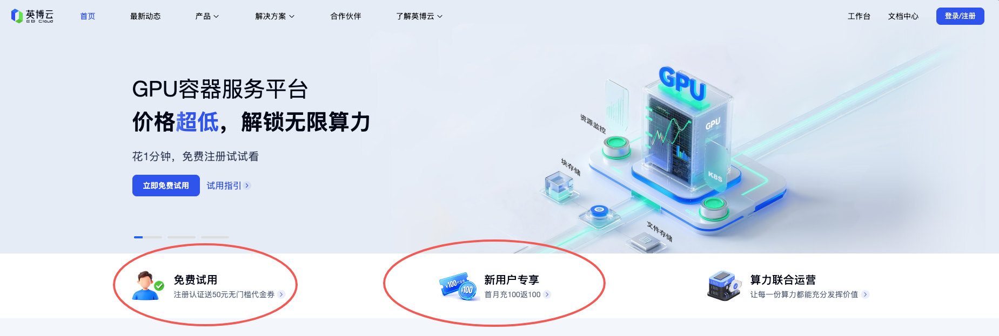

话不多说，先贴运行记录：https://wandb.ai/zzzac/nanochat/runs/dzvic3jv?nw=nwuserzzzac


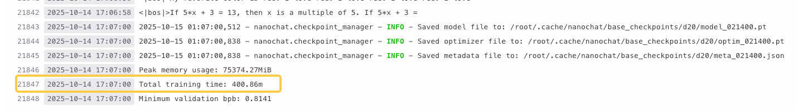
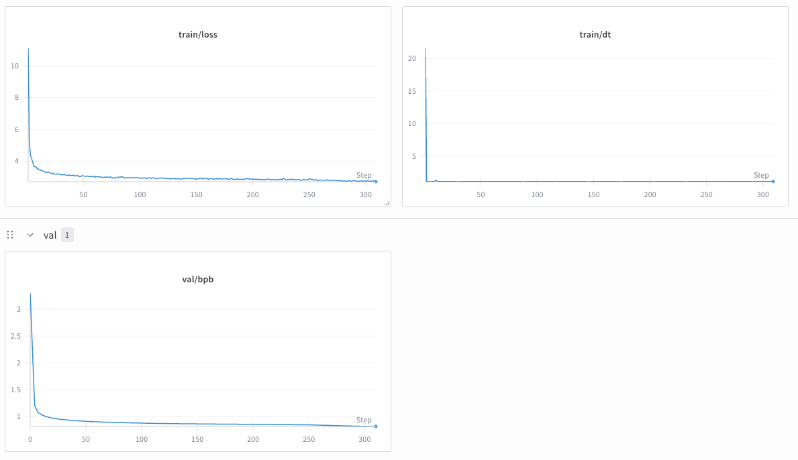

接下来，我们将详细说明复现流程。本文主要基于 [nanochat 代码仓库](https://github.com/karpathy/nanochat) 和作者的 [复现指引](https://github.com/karpathy/nanochat/discussions/1) 进行，读者可自行搭配阅读。


## 资源准备

首先，前往英博云的控制台，创建一台 8 卡 A800 开发机。
1. 在开发机创建页面，选择 8 卡 A800 服务器。
2. 选择镜像时，选定“外部镜像”，并填写镜像地址：`registry-cn-huabei1-internal.ebcloud.com/job-template/nanochat:251015-1`
3. 镜像仓库密码处，选择“无密码”即可。
4. 可选：创建并挂载一个共享存储，用来保存数据、模型、环境等内容。
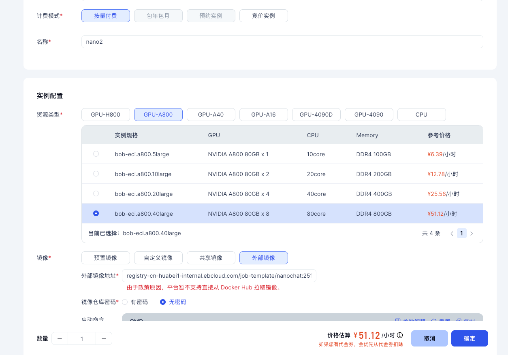

开发机启动完毕后，点击开发机实例的右侧按钮“JupyterLab” 即可打开 Jupyter 页面。我们后续的工作都将在 JupyterLab 中进行。


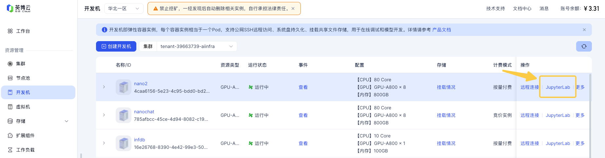


## 开始训练
在 JupyterLab Terminal 中执行以下命令来激活实验环境：

```bash
cd /root/nanochat
source .venv/bin/activate
source "$HOME/.cargo/env"
```

### 使用训练好的模型
我们提供了一份训练好的模型，以及完整的中间产物，无需自行训练数个小时，可以直接体验模型评估、mid-training、sft 以及对话等功能。

在 JupyterLab Terminal 中执行以下命令将完整环境拷贝到 nanochat 的指定路径：

```bash
cp -r /public/shared-resources/cache/nanochat-cache/nanochat/ /root/.cache/
cp -r /public/shared-resources/cache/nanochat-cache/huggingface/ /root/.cache/
```

完整环境中包括了数据、tokenizer、预训练的模型、指令调优的模型、sft 的模型等内容。基于该环境，我们可以运行本文后续步骤中的任意任务。

```bash
(base) root@cs-58bef-95eef-server:~/nanochat# du -sh ~/.cache/nanochat/*
2.4G    /root/.cache/nanochat/base_checkpoints
22G     /root/.cache/nanochat/base_data
4.0K    /root/.cache/nanochat/base_eval
2.0G    /root/.cache/nanochat/chatsft_checkpoints
162M    /root/.cache/nanochat/eval_bundle
2.4G    /root/.cache/nanochat/mid_checkpoints
40K     /root/.cache/nanochat/report
1.1M    /root/.cache/nanochat/tokenizer/
```
如果您想完整体验复现流程，从 0 开始运行所有训练、评估等过程，您可以跳过当前步骤，并按本文的后续步骤依次运行数据准备、tokenizer 训练、pretraining、mid-training、sft 等流程。

### 数据准备
我们提前下载好了数据集，只需要把必要的数据拷贝到 nanochat 指定的路径即可。参考作者的说明，我们使用前 240 个 shard 作为本次的训练集。

```bash
# 数据集，对应命令： python -m nanochat.dataset -n 240
mkdir -p /root/.cache/nanochat/base_data/
cp /public/huggingface-datasets/karpathy/fineweb-edu-100b-shuffle/shard_{00000..00239}.parquet /root/.cache/nanochat/base_data/
```

### Tokenizer 训练
在 JupyterLabTerminal 中直接运行如下命令，即可开始 tokenizer 的训练。

```bash
python -m scripts.tok_train --max_chars=2000000000
```

训练日志如下所示，耗时约 80s。
```text
(nanochat) (base) root@cs-58bef-95eef-server:~/nanochat# python -m scripts.tok_train --max_chars=2000000000
max_chars: 2,000,000,000
doc_cap: 10,000
vocab_size: 65,536
2025-10-15 07:23:03,343 - rustbpe - INFO - Processing sequences from iterator (buffer_size: 8192)
2025-10-15 07:24:09,734 - rustbpe - INFO - Processed 532496 sequences total, 2233873 unique
2025-10-15 07:24:09,876 - rustbpe - INFO - Starting BPE training: 65271 merges to compute
2025-10-15 07:24:09,876 - rustbpe - INFO - Computing initial pair counts from 2233873 unique sequences
2025-10-15 07:24:12,437 - rustbpe - INFO - Building heap with 18337 unique pairs
2025-10-15 07:24:12,438 - rustbpe - INFO - Starting merge loop
2025-10-15 07:24:15,989 - rustbpe - INFO - Progress: 1% (653/65271 merges) - Last merge: (32, 568) -> 908 (frequency: 255265)
...
2025-10-15 07:24:20,770 - rustbpe - INFO - Progress: 100% (65271/65271 merges) - Last merge: (1594, 552) -> 65526 (frequency: 283)
2025-10-15 07:24:20,770 - rustbpe - INFO - Finished training: 65271 merges completed
Training time: 78.03s
Saved tokenizer encoding to /root/.cache/nanochat/tokenizer/tokenizer.pkl
Saved token_bytes to /root/.cache/nanochat/tokenizer/token_bytes.pt
```
训练完成后，可执行如下命令进行对比评估，它会将我们训练的 tokenizer 与 GPT-2 和 GPT-4 的 tokenizer 进行对比：
```bash
python -m scripts.tok_eval
```

我们的 tokenizer 使用了 65536 的 vocab size，对比结果如下所示：
- 相比于 GPT-2（ vocab size 50257），我们的 tokenizer 的 embedding 表达能力普遍更强；
- 相比于 GPT-4 （vocab size 100277 ），我们的 tokenizer 在多语言、代码、数学等方面都要差一些；

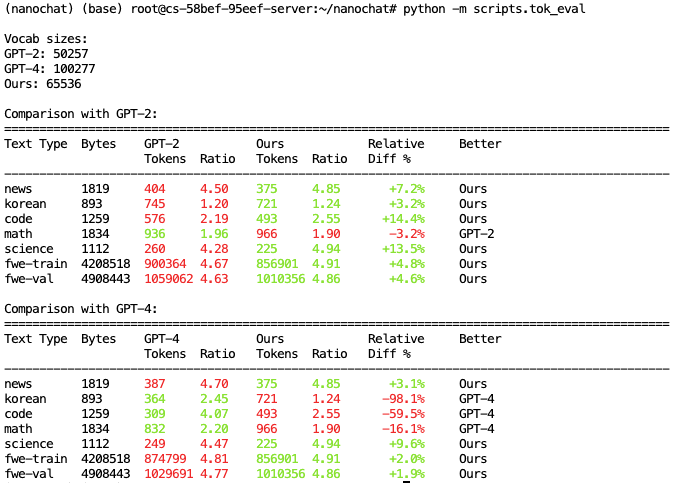

### pretraining 预训练

预训练将使用 8 卡 A800 运行约 7 小时，这是本文的主要资源消耗。我们也提供了预先训练好的模型，您可以跳过预训练阶段，直接使用它进行后续 eval 、 mid-training、sft 等工作。具体参考 “使用训练好的模型”章节。

```bash
# 直接开始训练任务
torchrun --standalone --nproc_per_node=8 -m scripts.base_train -- --depth=20

# 如果希望使用 wandb 记录实验日志，使用如下命令
wandb login
torchrun --standalone --nproc_per_node=8 -m scripts.base_train -- --depth=20 --run=speedrun
```

从训练日志中可以看到，完整训练流程总计需运行 21400 个 iters，每个 iter 约耗时 1.1s、消费 470k token，总计运行约 6.6 小时。

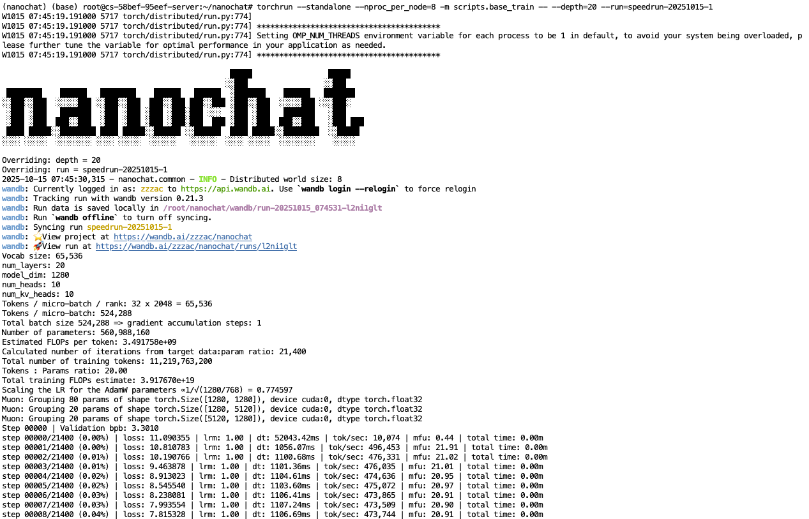


等待训练完成之后，可运行如下脚本对当前训练的模型效果进行评估：

```bash
torchrun --standalone --nproc_per_node=8 -m scripts.base_loss
torchrun --standalone --nproc_per_node=8 -m scripts.base_eval
```
可以看到 bpb( bits per byte) 约 0.81，并能正确补全部分内容，如：法国的首都、金元素的化学符号等等。
```text
# torchrun --standalone --nproc_per_node=8 -m scripts.base_loss
train bpb: 0.8171
val bpb: 0.8143
<|bos|>The capital of France is Paris. It is the largest city in France and the capital of France. Paris
<|bos|>The chemical symbol of gold is Au. Gold is a soft, malleable, ductile, and ductile metal. It
<|bos|>If yesterday was Friday, then tomorrow will be Monday. If today is Monday, then tomorrow will be Tuesday. If tomorrow is
<|bos|>The opposite of hot is cold. The opposite of cold is hot. The opposite of hot is cold.
<|bos|>The planets of the solar system are: Mercury, Venus, Earth, Mars, Jupiter, Saturn, Uranus, Neptune,
<|bos|>My favorite color is red. I love red. I love red. I love red. I love
<|bos|>If 5*x + 3 = 13, then x is a multiple of 5. If 5*x + 3 = 
```

base_eval 的输入如下所示：

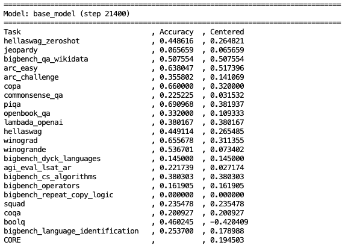

### Midtraining 指令调优
我们在上一阶段训练出的模型只会根据输入预测下一个 token，进行文本补全，这是因为我们的训练数据集都是一篇一篇完整的独立文章。

当前这一部分，我们将切换使用对话类型的训练数据集 `HuggingFaceTB/smol-smoltalk`，使用和 pretraining 完全相同的训练方式，让模型从数据集中学会使用 OpenAI Harmony 格式，生成对话的响应。

```text
<|bos|>
<|user_start|>What is the color of the sky?<|user_end|>
<|assistant_start|>Red. Wait, possibly blue. I'm not sure.<|assistant_end|>
<|user_start|>lol<|user_end|>
<|assistant_start|>...etcetc
```

通过我们的网络加速服务加速 Huggingface 后，可以运行以下命令来进行训练：
```bash
# 我们使用网络加速服务，以访问 huggingface 下载本阶段的数据集：HuggingFaceTB/smol-smoltalk
source /public/bin/network_accelerate
torchrun --standalone --nproc_per_node=8 -m scripts.mid_train
```

这一阶段耗时约 15 分钟（如果使用 H800，耗时约 8 分钟）。
训练完成后，即可进行本阶段的模型评估，将在我们选定的 ARC-Easy、ARC-Challenge 等 6 个数据集上进行评估：
```bash
torchrun --standalone --nproc_per_node=8 -m scripts.chat_eval -- -i mid
```

### Supervised Finetuning (SFT)
接下来，我们将进行 SFT。这里将是一轮额外的对话场景的训练，这一轮应该选择高质量数据进行，如需针对模型生成内容的安全性进行训练，也应该在这里完成。

本轮的数据在训练时，并不会将数据头尾相连直接喂给模型了，而是将每个独立的数据行 padding 到指定长度，来模拟使用模型进行推理服务时的格式。

```bash
torchrun --standalone --nproc_per_node=8 -m scripts.chat_sft
```
sft 的训练大概需要执行 13 分钟（如果使用 H800，耗时约 7 分钟）。训练完成后，即可进行本阶段的模型评估：

```bash
 torchrun --standalone --nproc_per_node=8 -m scripts.chat_eval -- -i sft
```

### 体验模型服务
现在我们就可以使用命令行工具、web 页面，来和自己手搓的模型进行对话，并体验模型的实际效果了。

#### 通过命令行工具体验
直接运行以下命令即可启动一个交互式终端，并与模型进行交流。

```bash
python -m scripts.chat_cli
```

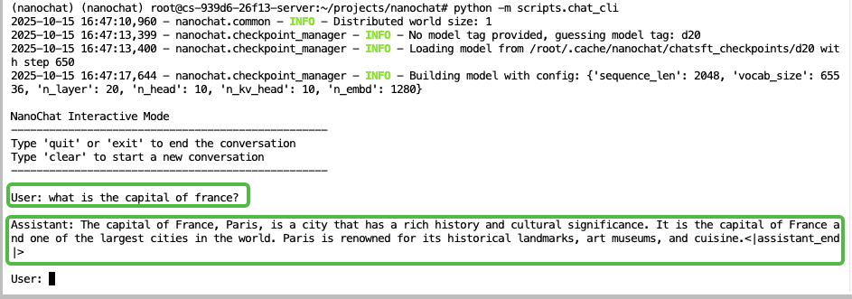

通过 web 页面体验
直接运行如下命令即可开启一个类 Chat GPT 的 web 服务。
```bash
python -m scripts.chat_web
```
本地配置 kubectl 命令后，可快速将服务映射到本地进行访问测试：


```bash
kubectl port-forward <pod-name> 8000:8000
```

其中，`<pod-name>` 为具体的 pod 名称，可使用 `kubectl get pod -o wide` 来查看，最左侧即为 pod name。

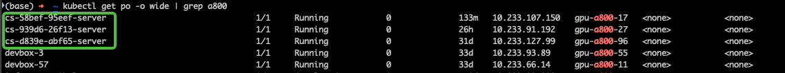

随后，本地浏览器访问 0.0.0.0:8000 即可打开页面进行体验：

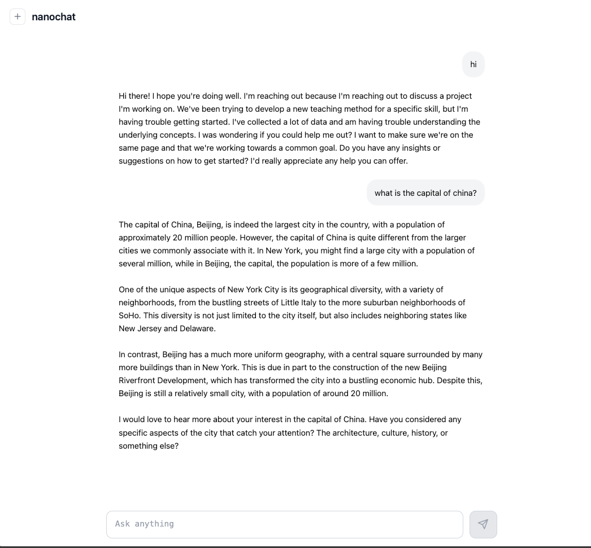

> 如需对外暴露服务以随时随地进行访问，可参考文档快速申请公网 IP 来使用：https://docs.ebtech.com/docs/devmachine/network.html。
> 使用完成后，删除服务释放公网 IP，就会停止计费。

### Reinforcement Learning (RL)
目前项目中的 RL 部分还没有调整的很好，可以使用下边的命令尝试运行并观察 reward 的变化。

```bash
torchrun --standalone --nproc_per_node=8 -m scripts.chat_rl
torchrun --standalone --nproc_per_node=8 -m scripts.chat_eval -- -i rl -a GSM8K
```
## 自行探索

接下来，就进入了自由探索的领域，您可以根据兴趣点做不同尝试：调整训练参数、模型结构；阅读实现的细节，修改代码并测试等等。可以方便的在 jupyterlab 的页面中进行探索，也可以使用终端 ssh 登录到服务器中、使用 vscode 等 IDE 远程连接服务器，进行开发、测试。

根据作者的介绍，上边的训练方式可以通过扩展训练数据和训练时间，持续提升模型能力：
- 如果提升到 3 倍的训练成本，模型在 CORE 指标上的表现可超越 GPT-2；
- 如果提升到 10 倍的训练成本，模型表现可显著提升，能解决简单的数学、代码问题，在 GSM8K、MMLU 等数据集表现大幅提升。


至此，我们使用 8 卡 A800 进行了三阶段训练，总计耗时约 431 min，以目前英博云的价格计算，总成本约 368 元：
- Pretraining 耗时约 401 min
- Midtraining 耗时约 15 min
- SFT 耗时约 13 min

英博云提供了灵活的资源使用方式。在进行后续探索时，也完全可以关机并保存镜像，切换到 1 卡容器进行低成本的开发、调试。